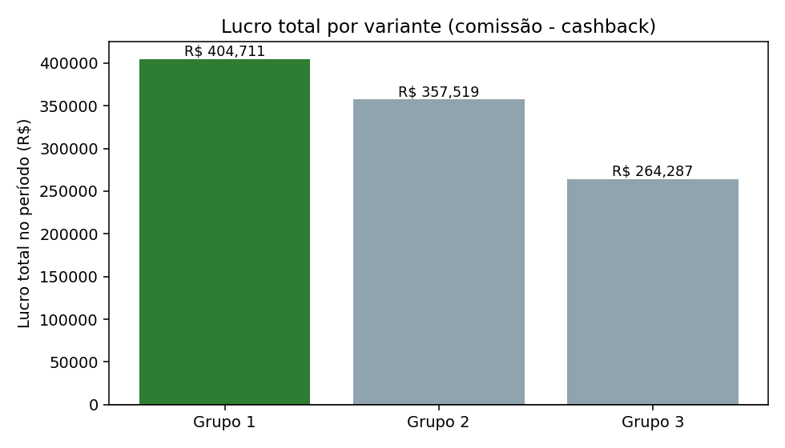
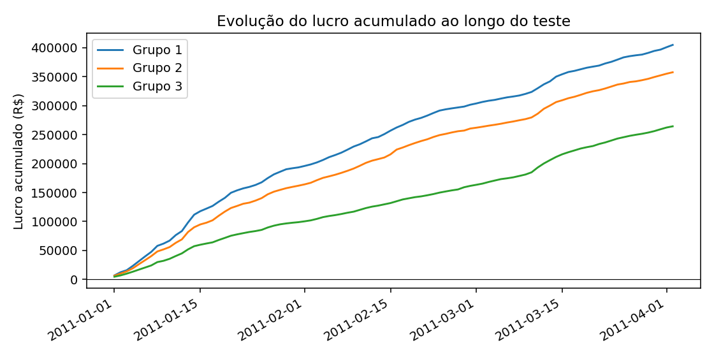

# Relatório de Teste A/B — Parceiro A

**Período analisado:** 2011-01-01 a 2011-04-02 (92 dias)
**Grupos comparados:** Grupo 1, Grupo 2, Grupo 3
**Métrica-alvo desta análise:** Lucro líquido (comissão − cashback)
**Gerado em:** 2026-07-15 20:19:54

---

## 🎯 Decisão

> **As variantes não apresentam diferença estatisticamente significativa em Lucro líquido (comissão − cashback) (alpha=0.05), mesmo com amostra considerada suficiente. Escalar qualquer uma não é sustentado pelos dados — considere manter a configuração atual ou testar uma variação mais ousada.**

| Recomendação | Confiança | Impacto financeiro | Risco |
|---|---|---|---|
| `NENHUMA_VARIANTE_SIGNIFICATIVA` | Baixa | Alto | Alto |

- **Vencedor de negócio (por Lucro líquido (comissão − cashback)):** Grupo 1
- **Efeito prático vs. 2º colocado:** +13.2%/dia
- **Significativo estatisticamente contra todos os demais grupos?** Não

*Por que essa métrica:* Lucro líquido é a métrica padrão porque representa o impacto financeiro direto para o Méliuz — quanto sobra no caixa depois de pagar o cashback ao usuário. É a resposta mais direta a 'vale escalar?' quando o objetivo do teste não foi especificado de outra forma.

---

## 🔍 Observações automáticas

Padrões factuais detectados nos dados — não substituem uma leitura crítica humana, mas apontam onde vale investigar antes de decidir:

- 'Grupo 3' tem o maior volume de compradores, mas 'Grupo 1' tem o maior lucro líquido — o grupo que mais vende não é o mais rentável. O custo de cashback parece estar corroendo parte do ganho de volume em 'Grupo 3'.
- 'Grupo 3' distribui 7.42% do GMV em cashback, contra 4.16% em 'Grupo 1' — uma diferença de 3.3 pontos percentuais no incentivo entre as variantes.

---

## 📊 Métricas por variante

| Métrica | Grupo 1 | Grupo 2 | Grupo 3 |
|---|---|---|---|
| Dias observados | 92 | 92 | 92 |
| Compradores (total) | 9633 | 10814 | 11410 |
| Compradores/dia (média) | 104.71 | 117.54 | 124.02 |
| Comissão total | R$ 638.135,00 | R$ 728.178,00 | R$ 767.887,00 |
| Cashback total | R$ 233.424,00 | R$ 370.659,00 | R$ 503.600,00 |
| Vendas totais (GMV) | R$ 5.605.173,00 | R$ 6.423.096,00 | R$ 6.785.856,00 |
| Lucro total | R$ 404.711,00 | R$ 357.519,00 | R$ 264.287,00 |
| Lucro médio/dia | R$ 4.399,03 | R$ 3.886,08 | R$ 2.872,68 |
| ROI (comissão/cashback) | 2.7338 | 1.9645 | 1.5248 |
| Ticket médio | R$ 581,87 | R$ 593,96 | R$ 594,73 |
| Take rate (comissão/GMV) | 11.38% | 11.34% | 11.32% |
| Cashback rate (cashback/GMV) | 4.16% | 5.77% | 7.42% |

---

## ⚠️ Avisos de qualidade de dados

- 🔵 **[outlier_days_detected]** Dias com lucro atípico (|z| > 3.0) detectados por grupo (Grupo 1: 2, Grupo 2: 1, Grupo 3: 3). Não foram removidos automaticamente — podem ser picos legítimos (ex: promoção pontual).

---

<strong>🔬 Metodologia estatística (detalhes para auditoria)</strong>

- **Unidade de análise:** dia (métrica testada: Lucro líquido (comissão − cashback))
- **Método escolhido:** `kruskal_wallis` — não-paramétrico (pelo menos um grupo não passou no teste de normalidade de Shapiro-Wilk, ou variâncias muito diferentes entre grupos, ou n pequeno demais)
- **p-valor do teste global:** 1e-06 (alpha = 0.05)

**Normalidade por grupo (Shapiro-Wilk):**
- Grupo 1: p = 0.0 (não-normal)
- Grupo 2: p = 0.0 (não-normal)
- Grupo 3: p = 0.0 (não-normal)

**Comparações par-a-par (correção de Bonferroni):**

| Comparação | Teste | p (ajustado) | Significativo? | Effect size |
|---|---|---|---|---|
| Grupo 1 vs Grupo 2 | mann_whitney_u | 0.434916 | Não | -0.1245 |
| Grupo 1 vs Grupo 3 | mann_whitney_u | 4e-06 | Sim | -0.4121 |
| Grupo 2 vs Grupo 3 | mann_whitney_u | 0.000273 | Sim | -0.3341 |

---

## 🧭 Limitações conhecidas

- Os dados não incluem visitantes/sessões, apenas compradores — não é possível calcular taxa de conversão, só volume de compra e resultado financeiro.
- A granularidade é diária por grupo, não por usuário — o teste estatístico compara dias, não usuários individuais, então o "n" efetivo é o número de dias observados.
- A decisão assume que os grupos foram alocados aleatoriamente e rodaram de forma concorrente no mesmo período — este pipeline não consegue validar a aleatorização em si.
- A métrica-alvo desta análise foi **Lucro líquido (comissão − cashback)**; rodar com `--metrica-alvo` diferente (`lucro`, `roi` ou `compradores`) pode indicar um vencedor diferente — vale checar se o objetivo do teste era mesmo esse.
