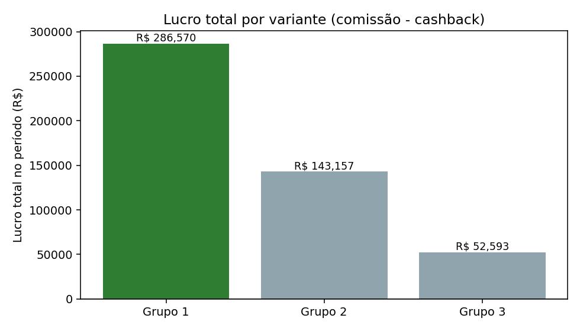
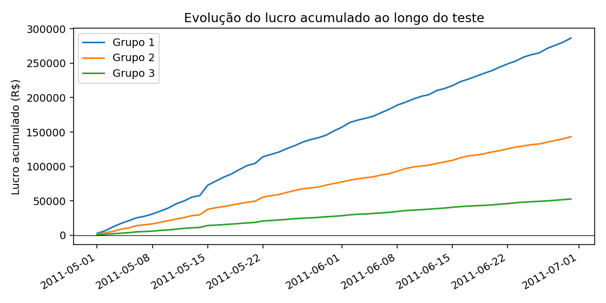

# Relatório de Teste A/B — Parceiro B

**Período analisado:** 2011-05-01 a 2011-06-30 (61 dias)
**Grupos comparados:** Grupo 1, Grupo 2, Grupo 3
**Métrica-alvo desta análise:** Lucro líquido (comissão − cashback)
**Gerado em:** 2026-07-15 20:19:55

---

## 🎯 Decisão

> **'Grupo 1' deve ser escalado para 100% do tráfego, otimizando Lucro líquido (comissão − cashback): +100.2% vs. 2º colocado, diferença estatisticamente significativa contra todas as demais variantes (alpha=0.05), impacto financeiro alto e risco baixo.**

| Recomendação | Confiança | Impacto financeiro | Risco |
|---|---|---|---|
| `ESCALAR_GRUPO_1` | Alta | Alto | Baixo |

- **Vencedor de negócio (por Lucro líquido (comissão − cashback)):** Grupo 1
- **Efeito prático vs. 2º colocado:** +100.2%/dia
- **Significativo estatisticamente contra todos os demais grupos?** Sim

*Por que essa métrica:* Lucro líquido é a métrica padrão porque representa o impacto financeiro direto para o Méliuz — quanto sobra no caixa depois de pagar o cashback ao usuário. É a resposta mais direta a 'vale escalar?' quando o objetivo do teste não foi especificado de outra forma.

---

## 🔍 Observações automáticas

Padrões factuais detectados nos dados — não substituem uma leitura crítica humana, mas apontam onde vale investigar antes de decidir:

- 'Grupo 3' distribui 9.0% do GMV em cashback, contra 4.0% em 'Grupo 1' — uma diferença de 5.0 pontos percentuais no incentivo entre as variantes.

---

## 📊 Métricas por variante

| Métrica | Grupo 1 | Grupo 2 | Grupo 3 |
|---|---|---|---|
| Dias observados | 61 | 61 | 61 |
| Compradores (total) | 7990 | 5452 | 5029 |
| Compradores/dia (média) | 130.98 | 89.38 | 82.44 |
| Comissão total | R$ 450.321,00 | R$ 314.935,00 | R$ 289.290,00 |
| Cashback total | R$ 163.751,00 | R$ 171.778,00 | R$ 236.697,00 |
| Vendas totais (GMV) | R$ 4.093.818,00 | R$ 2.863.019,00 | R$ 2.629.963,00 |
| Lucro total | R$ 286.570,00 | R$ 143.157,00 | R$ 52.593,00 |
| Lucro médio/dia | R$ 4.697,87 | R$ 2.346,84 | R$ 862,18 |
| ROI (comissão/cashback) | 2.75 | 1.8334 | 1.2222 |
| Ticket médio | R$ 512,37 | R$ 525,13 | R$ 522,96 |
| Take rate (comissão/GMV) | 11.0% | 11.0% | 11.0% |
| Cashback rate (cashback/GMV) | 4.0% | 6.0% | 9.0% |

---

## ⚠️ Avisos de qualidade de dados

- 🔵 **[outlier_days_detected]** Dias com lucro atípico (|z| > 3.0) detectados por grupo (Grupo 1: 1, Grupo 2: 2, Grupo 3: 2). Não foram removidos automaticamente — podem ser picos legítimos (ex: promoção pontual).

---

<strong>🔬 Metodologia estatística (detalhes para auditoria)</strong>

- **Unidade de análise:** dia (métrica testada: Lucro líquido (comissão − cashback))
- **Método escolhido:** `kruskal_wallis` — não-paramétrico (pelo menos um grupo não passou no teste de normalidade de Shapiro-Wilk, ou variâncias muito diferentes entre grupos, ou n pequeno demais)
- **p-valor do teste global:** 0.0 (alpha = 0.05)

**Normalidade por grupo (Shapiro-Wilk):**
- Grupo 1: p = 0.0 (não-normal)
- Grupo 2: p = 0.0 (não-normal)
- Grupo 3: p = 0.0 (não-normal)

**Comparações par-a-par (correção de Bonferroni):**

| Comparação | Teste | p (ajustado) | Significativo? | Effect size |
|---|---|---|---|---|
| Grupo 1 vs Grupo 2 | mann_whitney_u | 0.0 | Sim | -0.8586 |
| Grupo 1 vs Grupo 3 | mann_whitney_u | 0.0 | Sim | -0.9968 |
| Grupo 2 vs Grupo 3 | mann_whitney_u | 0.0 | Sim | -0.9476 |

---

## 🧭 Limitações conhecidas

- Os dados não incluem visitantes/sessões, apenas compradores — não é possível calcular taxa de conversão, só volume de compra e resultado financeiro.
- A granularidade é diária por grupo, não por usuário — o teste estatístico compara dias, não usuários individuais, então o "n" efetivo é o número de dias observados.
- A decisão assume que os grupos foram alocados aleatoriamente e rodaram de forma concorrente no mesmo período — este pipeline não consegue validar a aleatorização em si.
- A métrica-alvo desta análise foi **Lucro líquido (comissão − cashback)**; rodar com `--metrica-alvo` diferente (`lucro`, `roi` ou `compradores`) pode indicar um vencedor diferente — vale checar se o objetivo do teste era mesmo esse.
