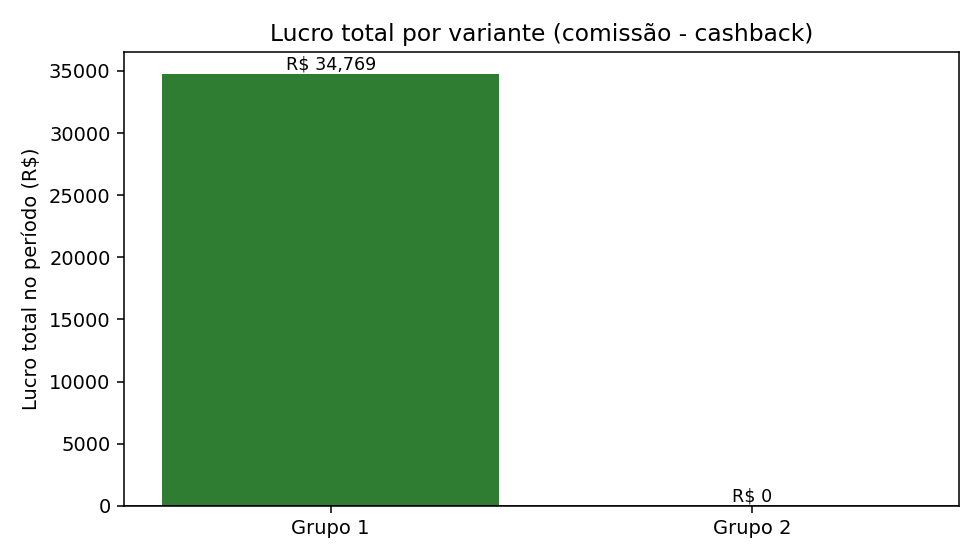
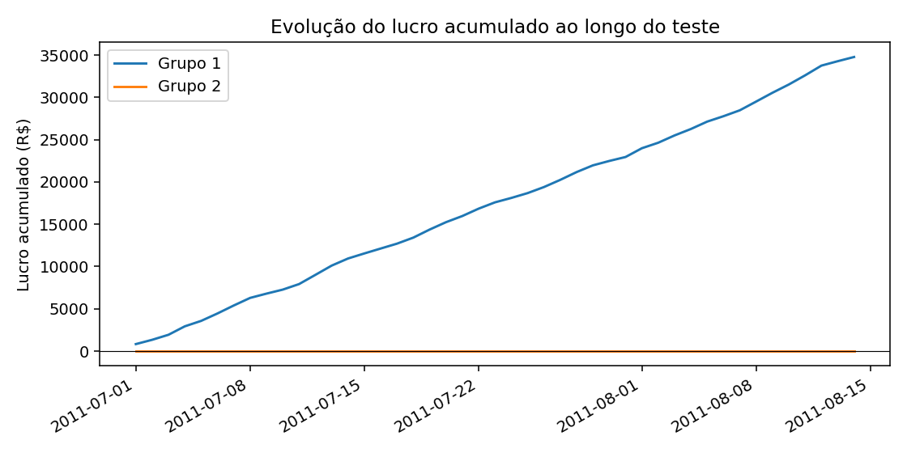

# Relatório de Teste A/B — Parceiro C

**Período analisado:** 2011-07-01 a 2011-08-14 (45 dias)
**Grupos comparados:** Grupo 1, Grupo 2
**Métrica-alvo desta análise:** Lucro líquido (comissão − cashback)
**Gerado em:** 2026-07-15 20:19:57

---

## 🎯 Decisão

> **'Grupo 1' deve ser escalado para 100% do tráfego, otimizando Lucro líquido (comissão − cashback): 2º colocado empata comissão=cashback (métrica zero); 'Grupo 1' é a única variante positiva, diferença estatisticamente significativa contra todas as demais variantes (alpha=0.05), impacto financeiro alto e risco baixo.**

| Recomendação | Confiança | Impacto financeiro | Risco |
|---|---|---|---|
| `ESCALAR_GRUPO_1` | Alta | Alto | Baixo |

- **Vencedor de negócio (por Lucro líquido (comissão − cashback)):** Grupo 1
- **Significativo estatisticamente contra todos os demais grupos?** Sim

*Por que essa métrica:* Lucro líquido é a métrica padrão porque representa o impacto financeiro direto para o Méliuz — quanto sobra no caixa depois de pagar o cashback ao usuário. É a resposta mais direta a 'vale escalar?' quando o objetivo do teste não foi especificado de outra forma.

---

## 📊 Métricas por variante

| Métrica | Grupo 1 | Grupo 2 |
|---|---|---|
| Dias observados | 45 | 45 |
| Compradores (total) | 4549 | 4522 |
| Compradores/dia (média) | 101.09 | 100.49 |
| Comissão total | R$ 121.693,00 | R$ 117.967,00 |
| Cashback total | R$ 86.924,00 | R$ 117.967,00 |
| Vendas totais (GMV) | R$ 1.738.460,00 | R$ 1.685.235,00 |
| Lucro total | R$ 34.769,00 | R$ 0,00 |
| Lucro médio/dia | R$ 772,64 | R$ 0,00 |
| ROI (comissão/cashback) | 1.4 | 1.0 |
| Ticket médio | R$ 382,16 | R$ 372,67 |
| Take rate (comissão/GMV) | 7.0% | 7.0% |
| Cashback rate (cashback/GMV) | 5.0% | 7.0% |

---

## ⚠️ Avisos de qualidade de dados

- 🔵 **[zero_variance_profit_group]** Grupo(s) ['Grupo 2'] têm lucro diário idêntico em todos os dias (possível variante de controle com comissão = cashback por desenho, ou dado sintético/simulado). Testes de normalidade não se aplicam a esses grupos.

---

<strong>🔬 Metodologia estatística (detalhes para auditoria)</strong>

- **Unidade de análise:** dia (métrica testada: Lucro líquido (comissão − cashback))
- **Método escolhido:** `mann_whitney_u` — não-paramétrico (pelo menos um grupo não passou no teste de normalidade de Shapiro-Wilk, ou variâncias muito diferentes entre grupos, ou n pequeno demais)
- **p-valor do teste global:** 0.0 (alpha = 0.05)

**Normalidade por grupo (Shapiro-Wilk):**
- Grupo 1: p = 0.0481 (não-normal)
- Grupo 2: p = None (n/a — amostra pequena ou variância zero)

**Comparações par-a-par (correção de Bonferroni):**

| Comparação | Teste | p (ajustado) | Significativo? | Effect size |
|---|---|---|---|---|
| Grupo 1 vs Grupo 2 | mann_whitney_u | 0.0 | Sim | -1.0 |

---

## 🧭 Limitações conhecidas

- Os dados não incluem visitantes/sessões, apenas compradores — não é possível calcular taxa de conversão, só volume de compra e resultado financeiro.
- A granularidade é diária por grupo, não por usuário — o teste estatístico compara dias, não usuários individuais, então o "n" efetivo é o número de dias observados.
- A decisão assume que os grupos foram alocados aleatoriamente e rodaram de forma concorrente no mesmo período — este pipeline não consegue validar a aleatorização em si.
- A métrica-alvo desta análise foi **Lucro líquido (comissão − cashback)**; rodar com `--metrica-alvo` diferente (`lucro`, `roi` ou `compradores`) pode indicar um vencedor diferente — vale checar se o objetivo do teste era mesmo esse.
